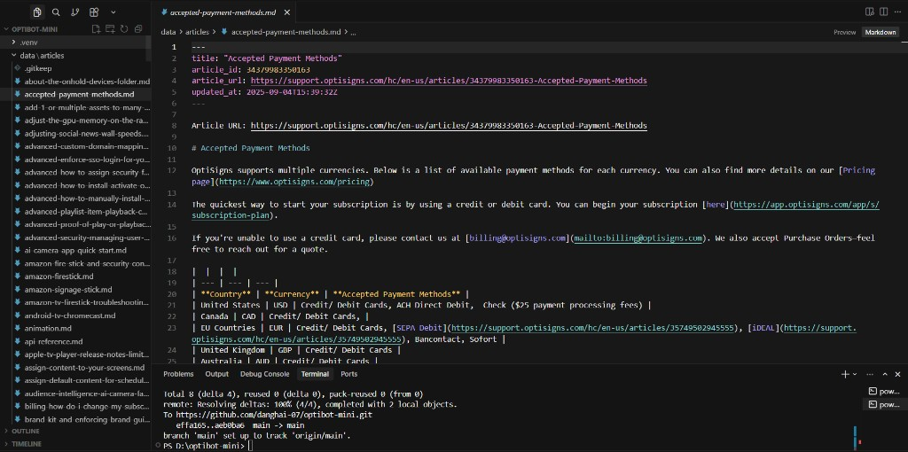
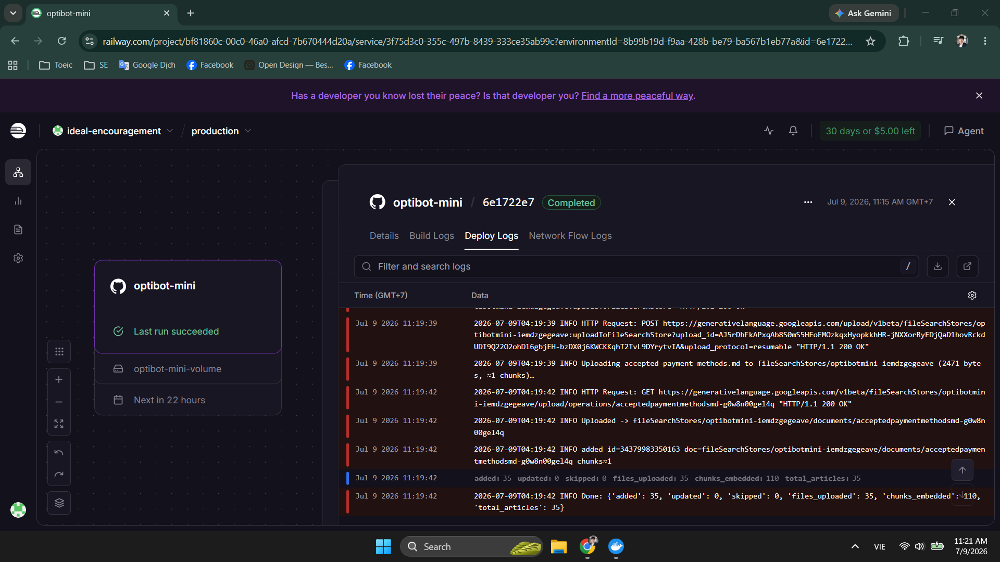
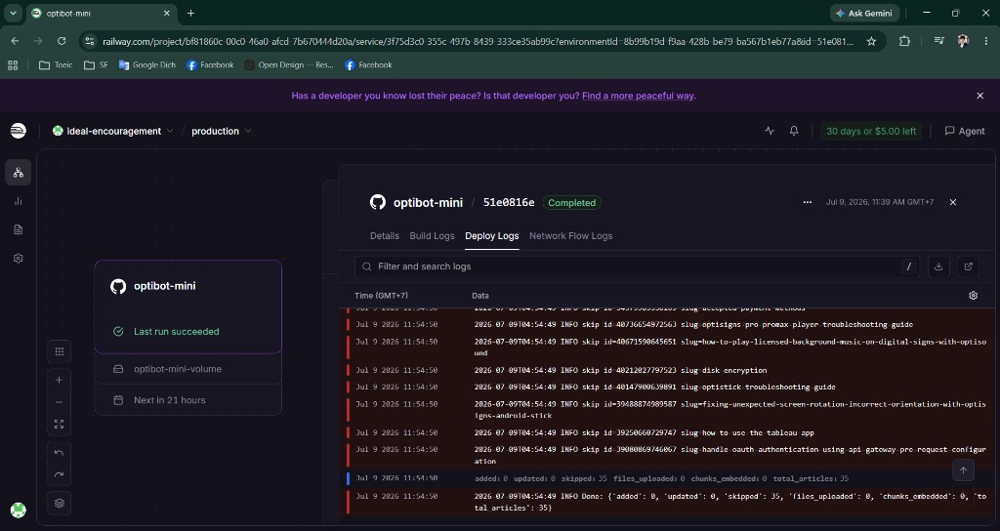
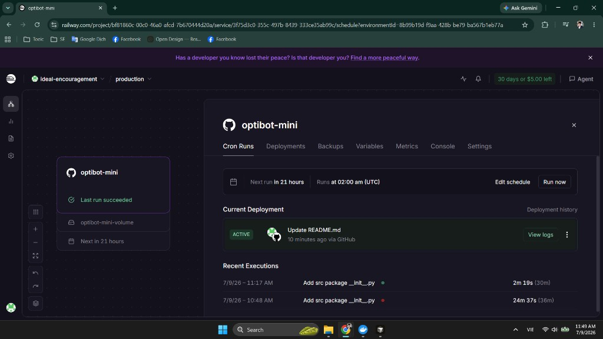
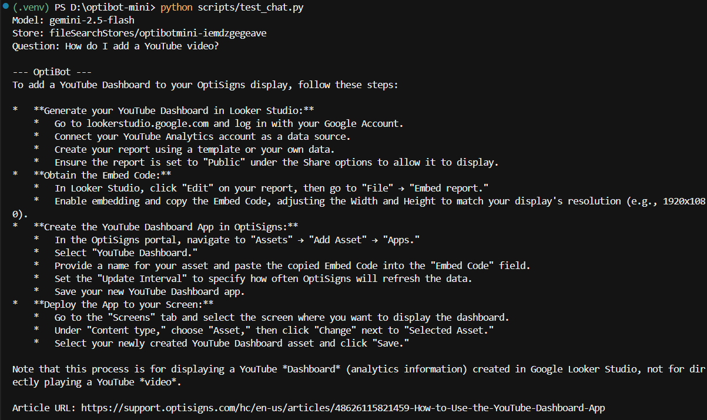

# OptiBot Mini

Daily scrape of OptiSigns Help Center → clean Markdown → Gemini File Search store sync (delta only).

## Prerequisites

- Python 3.12+
- [Google AI Studio](https://aistudio.google.com/) API key
- Gemini File Search store (create via script below)
- Docker (optional, for local/Railway runs)

**System prompt (verbatim):**

```
You are OptiBot, the customer-support bot for OptiSigns.com.
• Tone: helpful, factual, concise.
• Only answer using the uploaded docs.
• Max 5 bullet points; else link to the doc.
• Cite up to 3 "Article URL:" lines per reply.
```

Gemini File Search is API-first: bulk upload runs via `main.py`; chat sanity check uses `scripts/test_chat.py` (Playground does not expose store selection).

## Setup

```bash
cp .env.sample .env
# fill GEMINI_API_KEY
python -m venv .venv
# Windows: .venv\Scripts\activate
# macOS/Linux: source .venv/bin/activate
pip install -r requirements.txt
python scripts/create_gemini_store.py   # prints GEMINI_FILE_SEARCH_STORE value
```

Add the printed store name to `.env` as `GEMINI_FILE_SEARCH_STORE`.

**Switching from OpenAI:** reset `state/manifest.json` to `{"version": 1, "articles": {}}` or delete `document_id` fields so articles re-upload to Gemini.

## Run locally

```bash
python main.py
```

Stdout ends with a JSON summary, e.g. `{"added":42,"updated":0,"skipped":0,"files_uploaded":42,"chunks_embedded":…,"total_articles":42}`.

Tip: set `MAX_ARTICLES=40` for a smaller first sync; unset it for the full catalog.

**Docker** (start Docker Desktop first):

```bash
docker build -t optibot-mini .
docker run --rm \
  -e GEMINI_API_KEY \
  -e GEMINI_FILE_SEARCH_STORE \
  -v "$(pwd)/state:/app/state" \
  optibot-mini
```

Exit code `0` on success. Scrape-only (no Gemini): `python scripts/scrape_only.py`.

**Sanity check (after sync):**

```bash
python scripts/test_chat.py
# or: python scripts/test_chat.py "How do I add a YouTube video?"
```

Answer should include bullet points and `Article URL:` citations from the File Search store.

## Chunking strategy

One Help Center article = one Markdown file (frontmatter + `Article URL:` line + body). Files upload directly to a Gemini File Search store, which chunks and embeds them server-side (default white-space chunking). We estimate chunk counts from file size for logs.

Delta sync: SHA-256 of cleaned Markdown vs `state/manifest.json`. Unchanged hashes with a `document_id` are skipped; updates delete the old Gemini document then re-upload.

## Railway daily job

1. New Railway project → Deploy from this GitHub repo (Dockerfile).
2. Set env vars from `.env.sample`.
3. Add a **Volume** mounted at `/app/state` so `manifest.json` persists across runs.
4. Convert / add a **Cron** schedule (`0 2 * * *` UTC) that runs the service once and exits.
5. Confirm logs show `added` / `updated` / `skipped`.

**Job logs (Railway dashboard — login required):**  
https://railway.com/project/bf81860c-00c0-46a0-afcd-7b670444d20a/service/3f75d3c0-355c-497b-8439-333ce35ab99c

Public proof is in [Demonstration (screenshots)](#demonstration-screenshots) below.

## Demonstration (screenshots)

Screenshot walkthrough of all home-test requirements (substitute for video submission).

| Step | Requirement | Proof |
|------|-------------|-------|
| 1 | Scrape ≥30 Zendesk articles → Markdown | `data/articles/` (400+ `.md` files); frontmatter + `Article URL:` line |
| 2 | Upload to knowledge base via API + logs | Railway deploy log (first run: `added: 35`) |
| 3 | Delta sync (`added` / `updated` / `skipped`) | Re-run: `skipped: 35`, `added: 0` |
| 4 | Chunking | One article = one file; Gemini chunks server-side — see [Chunking strategy](#chunking-strategy) |
| 5 | Railway daily cron job | Cron `0 2 * * *` UTC; **Last run succeeded** |
| 6 | OptiBot chat + `Article URL:` citations | `scripts/test_chat.py` output |

**1. Scrape → Markdown** — 400+ articles in `data/articles/`; example file with frontmatter and `article_url`:



**2. API upload (first run)** — cron completed; JSON summary `added: 35`, `skipped: 0`:



**3. Delta sync (second run)** — unchanged articles skipped; `skipped: 35`, `added: 0`:



**4. Railway cron** — schedule `02:00 UTC`, volume mounted, **Last run succeeded**:



**5. OptiBot chat test** — question *How do I add a YouTube video?* with `Article URL:` citations:


